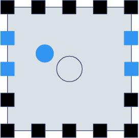

# Channel placement guide for object-based audio
Contrary to popular belief, speakers for object-based systems do not adhere to
specific angles. By design, object-based renderers place objects relative to the
room's walls, by the ratio between opposing walls. This happens because of the
industry's chosen rendering method, called balance-based rendering.

## How balance-based rendering works

Point object sources are rendered in a bounding speaker box by the ratio between
them. This requires a channel layout to be symmetric, because not only there are
front/rear, upper/lower channel pairs, but a left/right also has to be found to
get all corners. When the pairs are found, the closer wall to the object will be
louder. This is calculated on each axis, and the values corresponding to the
corner of each speaker will be multiplied together to get the final gain.

## What the true channel positions are
Reverse-engineering object-based content with Cavern resulted in the following
findings. Mixes rendered to the final channel layout contain a single,
motionless object at the channel's exact position so they get rendered to that
exact channel. This is only possible if the renderer chooses that position as
an output channel, meaning these are the true channel possitions.

These positions are also confirmed to be used by Dolby in Table B.10 of
ETSI TS 103 420 V1.2.1, which is the description of E-AC-3 + JOC.

Screen channels assume the screen spans perfectly from wall to wall. Because
this is mostly not the case at home, and no content or renderer known as of 2024
uses screen-anchored objects, it is inherent that the front left and right
channels have to be placed on the sides of the screen.

| Channel          | Euclidean coordinates | Y angle | X angle | Human-readable position                 |
|------------------|-----------------------|---------|---------|-----------------------------------------|
| Front Left       | -1, 0, 1              | -45°    | 0°      | Front wall, left side of the screen     |
| Front Right      | 1, 0, 1               | 45°     | 0°      | Front wall, right side of the screen    |
| Front Center     | 0, 0, 1               | 0°      | 0°      | Front wall, middle of the screen        |
| Rear Left        | -1, 0, -1             | -135°   | 0°      | Rear left corner                        |
| Rear Right       | 1, 0, -1              | 135°    | 0°      | Rear right corner                       |
| Side Left        | -1, 0, 0              | -90°    | 0°      | Middle of the left wall                 |
| Side Right       | 1, 0, 0               | 90°     | 0°      | Middle of the right wall                |
| Wide Left        | -1, 0, 0.677419       | -55.89° | 0°      | Left wall, about 16% from the front     |
| Wide Right       | 1, 0, 0.677419        | 55.89°  | 0°      | Right wall, about 16% from the front    |
| Top Front Left   | -1, 1, 1              | -45°    | -45°    | Ceiling, perfectly above Front Left     |
| Top Front Right  | 1, 1, 1               | 45°     | -45°    | Ceiling, perfectly above Front Right    |
| Top Front Center | 0, 1, 1               | 0°      | -45°    | Center of the front wall/ceiling corner |
| Top Rear Left    | -1, 1, -1             | -135°   | -45°    | Top rear left corner                    |
| Top Rear Right   | 1, 1, -1              | 135°    | -45°    | Top rear right corner                   |
| Top Rear Center  | 0, 1, -1              | 180°    | -45°    | Center of the rear wall/ceiling corner  |
| Top Side Left    | -1, 1, 0              | -90°    | -45°    | Midway between TFL and TRL positions    |
| Top Side Right   | 1, 1, 0               | 90°     | -45°    | Midway between TFR and TRR positions    |
| God's Voice      | 0, 1, 0               | 0°      | -90°    | Middle of the ceiling                   |

### Transforming the angles to specific rooms
The angles shown in the table on the Y (horizontal) and X (vertical) axes are
calculated from the center of the room, for a perfectly cubical room. The ideal
listening position is not that, it's about 2/3 to the back, but the angles
should stay, because these are not individual channels, but channel arrays. In a
commercial cinema, all speakers on the left wall used to play the left surround
channel's signal before object-based content appeared, giving all listeners the
experience of left sounds coming exactly from the left. Because in modern home
content, there are only two options on the side walls, side and wide speakers,
this directionality shall be preserved.

Knowing these, the most mathematically optimal way to get the actually mixed
soundstage is using a laser pointer from the main listener's head pointing to
the directions described here, and putting the speakers where they hit any wall
or the ceiling. This conveys the exact object movements described in content
rendered with Cavern, all other setups warp the space in a direction.
